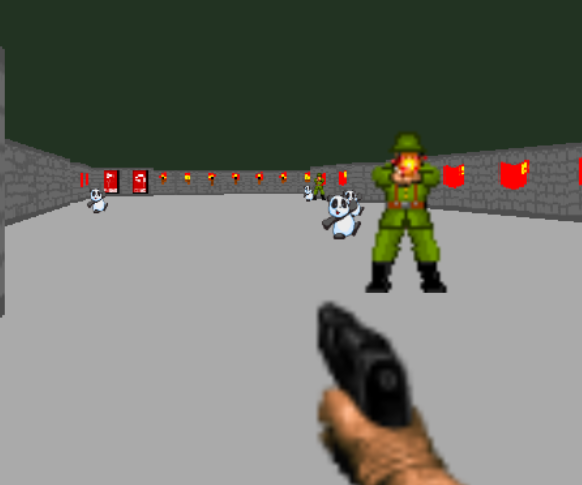

#Tentative space for name of Commie Killer Game

[Play the Game ...](https://rawgit.com/navonod2301/gladiator_3d/master/game_code/main.html)

## The Game

This game uses the Gladiator 3D engine created by [Matthias Ladkau](http://www.ladkau.de).

Our game has been inspired by games such as Wolfenstein and Doom, and we are using entirely our own assets for this project.
We have done our best to leave all credit for work on the engine and other RayCasting tutorials originally in the README for
the engine as stated originally. The base engine is not our work, but all assets, sprites, etc. are our work, and we have
modified parts of the engine to better suit the game and create a more enjoyable game.

Creating pseudo 3D games with HTML 5 canvas and raycasting tutorial
by Jacob Seidelin
http://dev.opera.com/articles/view/creating-pseudo-3d-games-with-html-5-can-1/

Ray-Casting Tutorial For Game Development And Other Purposes
by F. Permadi
http://www.permadi.com/tutorial/raycast/index.html

Lode's Raycasting Tutorial
by Lode Vandevenne
http://lodev.org/cgtutor/index.html

## License

Gladiator 3D is released under the [MIT license](http://mit-license.org).

## How to play

Simply press the link at the top of the README to reach our game

